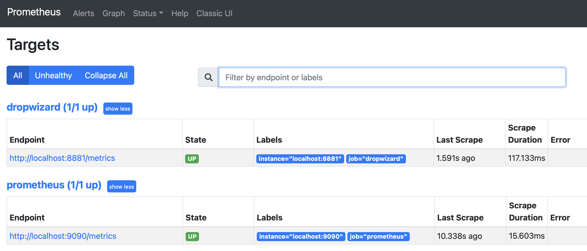
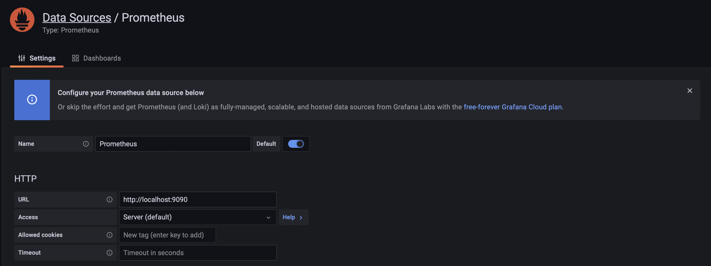
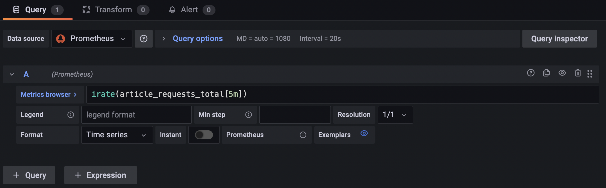
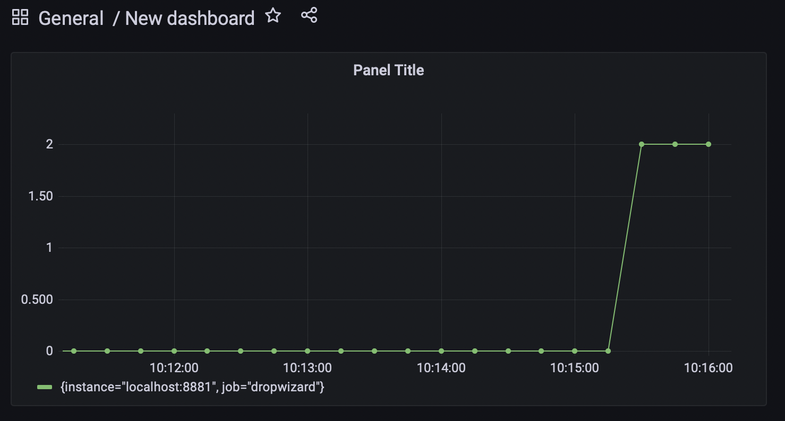

# Provenance

Provenance is a small service that periodically polls an RSS feed, ingests the articles it finds, and exposes them
over a JSON API — instrumented end-to-end with Dropwizard metrics so the pipeline can be observed in Prometheus and
Grafana.

### How it works

- **`EndpointWorkFinder` / `EndpointWorker`** (`components/endpoints`) — on a schedule, the work finder looks up
  ready endpoints (currently the InfoQ RSS feed, `https://feed.infoq.com/`) and the worker fetches each one, parses
  the RSS/XML response, and saves the resulting articles.
- **`ArticleDataGateway` / `ArticlesController`** (`components/articles`) — holds the ingested articles in memory and
  serves them over HTTP.
- **`WorkScheduler`** (`components/workflow-support`) — drives the polling loop on a fixed interval.
- **`BasicApp` / `BasicHandler` / `RestTemplate`** (`components/rest-support`) — small Kotlin foundation the app is
  built on: an embedded Jetty server, a handler base class for JSON endpoints, and an HTTP client used to call out to
  the RSS feed.
- **`MetricsController` / `HealthCheck`** (`components/metrics-support`) — exposes Dropwizard metrics to Prometheus
  and a basic health check.

### Endpoints

| Method | Path         | Description                              |
|--------|--------------|-------------------------------------------|
| GET    | `/articles`  | All ingested articles                     |
| GET    | `/available` | Articles currently marked as available    |
| GET    | `/metrics`   | Prometheus-formatted metrics              |
| GET    | `/health`    | Health check                              |

### Quick start

Build the project:

```bash
./gradlew clean build
```

Run the server:

```bash
java -jar applications/provenance-server/build/libs/provenance-server-1.0-SNAPSHOT.jar
```

The server listens on port `8881` by default (override with the `PORT` environment variable). Once started, the
endpoint worker will poll the configured RSS feed every 300 seconds and populate `/articles` and `/available`.

```bash
curl http://localhost:8881/articles
```

### Metrics: Prometheus

We use [Prometheus](https://prometheus.io/) to store metrics emitted by the service, including request rates
(`article-requests`, `article-available-requests`) and the current article count.

Install Prometheus and point it at the app's metrics endpoint.

```bash
brew install prometheus
```

Modify `/usr/local/etc/prometheus.yml` to match the example below (for Homebrew on Apple Silicon, use
`/opt/homebrew/etc/prometheus.yml`).

```yaml
  - job_name: 'dropwizard'
    metrics_path: '/metrics'
    scrape_interval: 5s
    scheme: http
    static_configs:
      - targets: [ 'localhost:8881' ]
```

Restart Prometheus.

```bash
brew services restart prometheus
```

Upon success, you should see the Dropwizard endpoint `http://localhost:8881/metrics` **UP** on the Prometheus
[Status Targets](http://localhost:9090/targets) page.



### Metrics: Grafana

We use [Grafana](https://grafana.com/) to query, visualize, and alert on the metrics stored in Prometheus.

Install and run Grafana.

```bash
brew install grafana
brew services restart grafana
```

Use the [web application](http://localhost:3000) to configure a Prometheus data source.



Add the data source at `http://localhost:3000/datasources/new`, using `http://localhost:9090` as the Prometheus URL.

Create a new dashboard and graph the `article_requests_total` metric. Use the query below to display requests per
second.

```
irate(article_requests_total[5m])
```



Drive traffic to the articles endpoint to generate data for the dashboard:

```bash
while [ true ]; do for i in {1..10}; do curl -v -H "Accept: application/json" http://localhost:8881/articles; done; sleep 5; done
```

Your dashboard should start recording data.



### Project layout

```
applications/provenance-server   # entry point, wires everything together
components/articles              # article storage and HTTP endpoints
components/endpoints              # RSS endpoint polling: work finder, worker, task
components/rss-support           # RSS/XML data model
components/workflow-support       # generic scheduled work-finder/worker framework
components/rest-support          # embedded Jetty app + handler base class + HTTP client
components/metrics-support       # Prometheus metrics endpoint + health check
```

© 2022 by Initial Capacity, Inc. All rights reserved.
